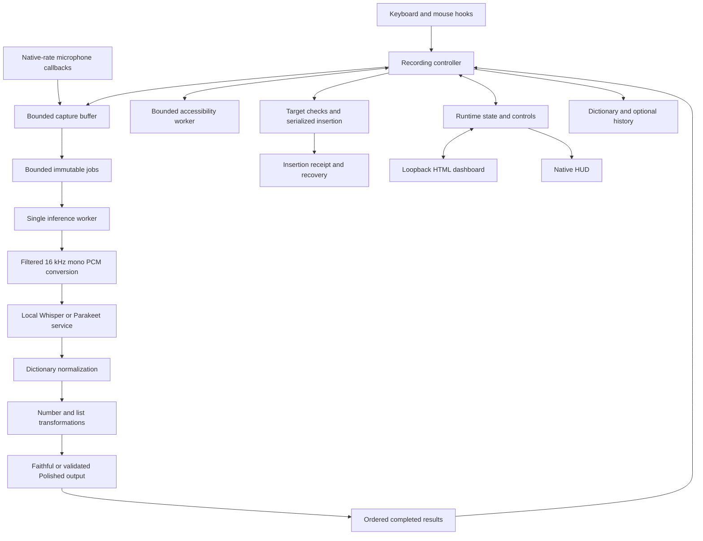

# Parla project handbook

**Consolidated September 21, 2026.** This document brings together the project's scattered Markdown records, preserves their useful implementation history, and separates shipped behavior from proposals. The repository baseline reviewed for Sections 1–11 is [`ef823d3aa4dab0f684012a67ffe24cd2fffe270e`](https://github.com/ILoveRestockMonitors/parla/commit/ef823d3aa4dab0f684012a67ffe24cd2fffe270e), the September 19 Windows bundled release. Local operational records extend through September 20. The September 21 addendum describes the newer implementation; [current state](current-state.md) and the [portable release](https://github.com/ILoveRestockMonitors/parla/releases/tag/v0.3.0-portable-20260921) identify its test and publication evidence.

For changes made after that baseline, the maintained [README](../README.md), [current state](current-state.md), and [changelog](../CHANGELOG.md) take precedence. Original Markdown files remain intact. The source index at the end identifies included, duplicate, historical, and unavailable material.

## Speech cleanup update — September 21, 2026

Current build: **`0.3.1-speech-cleanup-20260921`**. This section supersedes the earlier cleanup description. The detailed 0.3.0 records below describe that historical release.

Published [release v0.3.1-speech-cleanup-20260921](https://github.com/ILoveRestockMonitors/parla/releases/tag/v0.3.1-speech-cleanup-20260921) includes Windows EXE/Setup, Apple Silicon/Intel Mac PKGs and Linux DEB/archive. All 23 uploaded asset digests matched the tested originals or verified native CI index; anonymous public downloads were checked. Windows passed installation/uninstallation, hashes for 1,015 installed files, bundled Parakeet and Whisper fixture transcription, and settings preservation. The installer is 962,957,061 bytes, SHA-256 `42d759ff933798c2b5d9e924e6f4b1504f10b3be3c8172a6180826e46674e3fb`. Windows runtime source is `ab3a54d922ac6f0b6fa19bcae55f28158b657a9d`; native package source is `4e4db04a732b3f89517da7f4cb6e195c5d992709`. Their application/Cargo/VERSION sources are identical; the later commit makes native package versions follow release metadata.

Native [CI run 35657783410](https://github.com/ILoveRestockMonitors/parla/actions/runs/35657783410) passed 121 Rust tests on each Mac architecture and 122 on Linux, native installation, manifest/version checks and installed offline speech replay. Linux also passed relocated-tarball replay. The maintainer's idle Windows app was switched to this build with saved and active Polished mode, Clean speech enabled, unchanged settings during activation and 41 retained dictionary entries. Read-only checks confirmed microphone opening, keyboard/input hooks, speech/model service readiness and no runtime error. No new live microphone dictation or editor insertion was used as a test.

OpenWhispr uses a dedicated [transcript cleanup prompt](https://github.com/OpenWhispr/openwhispr/blob/a77fdce34dbc0932cc3eee90646017df9be1c876/src/locales/en/prompts.json), routed through [ReasoningService](https://github.com/OpenWhispr/openwhispr/blob/a77fdce34dbc0932cc3eee90646017df9be1c876/src/services/ReasoningService.ts) with dictionary context. Its cleanup behavior is separate from its agent behavior. Parla independently implements that separation in Rust: recognition → explicit dictionary replacements → fast speech cleanup → bounded Polished draft → local Ollama cleanup → validation → existing guarded insertion. No OpenWhispr source or prompt is copied.

The old Polished prompt prohibited false-start/correction handling and the validator required the same substantive word sequence. The new prompt asks for final completed phrases, clear fillers and spoken corrections to be cleaned while keeping the speaker's voice. Deterministic preparation handles clear noises/repeated fragments and bounded adjacent corrections; Polished draft preparation removes bounded repeated attempts before the model. The validator permits those removals and small article/agreement repairs while checking word order, numeric and negation anchors, protected vocabulary and identifiers. It rejects arbitrary new content and incomplete output. Clear “like” and “you know” uses remain content; ambiguous cases may remain unedited. Empty filler-only recognition does not produce an insertion. Code-editor polishing and automatic numeric/list routing retain their previous behavior.

The confirmed regression now produces: “This is a test. Yeah, I'm not sure. I'm looking at Parla right now. I'm purposely stuttering my words right now.” The “Paro → Parla” correction is a personal dictionary entry explicitly confirmed by the owner, not a global guessing rule. A replay with the saved 41-entry dictionary (19 canonical terms) produced the exact result in about 1.38 seconds with a warm qwen3.5:9b model. This is text cleanup timing, not speech-to-insertion latency. A cold model requires extra loading time.

The running settings initially reported Faithful although the dropdown screenshot showed Polished. Selecting a mode previously required a separate Save settings action. The new dropdown saves immediately, displays “Active: Polished/Faithful,” rejects stale polling responses and reports failures. Other unsaved controls remain pending. The existing stutter setting now appears as **Clean speech**, and turning it off preserves words in the model pass too. The owner's saved and active mode were verified as Polished with Clean speech enabled.

Validation: **147 Windows Rust tests passed, 0 failed, 4 opt-in live checks ignored**; **11/11** production local-model cases passed (exact reported paragraph, fillers, broken starts, explicit correction, meaningful like/you know, separate thoughts, numbers, negation, identifiers and dictated requests); **four** dashboard HTTP/DOM scenarios passed (mode autosave, other pending edits, late old response, failed write). The fixed prompt is tested without embedding the reported paragraph. No microphone capture or editor insertion is performed by these checks. Raw recognition and dictionary-normalized text remain available; rejected or unavailable model output falls back with a visible reason. This cannot guarantee correction of every recognition error or speech disfluency.

## Earlier September 21 implementation addendum and release status

The `0.3.0-portable-20260921` source adds the work summarized below. Windows passed 140 Rust tests and its installed-bundle checks; each Mac architecture passed 114 tests and Linux passed 115, with native package installation and bundled speech replay verified in [run 35613094718](https://github.com/ILoveRestockMonitors/parla/actions/runs/35613094718). Consult [current state](current-state.md) for publication evidence. These are bounded package checks, not proof of live microphone, permission or editor compatibility on every platform. Sections 1–11 retain the explicitly dated earlier baseline.

- **Architecture:** Parla keeps its shared Rust application core. OpenWhispr uses a JavaScript/TypeScript Electron shell with native speech engines/platform helpers; its separation of platform integration, model processes, and cleanup informed this work. Parla did not transplant the Electron shell or copy OpenWhispr source. See the pinned comparison reference and implementation detail in [current state](current-state.md).
- **Wording-preserving stutter cleanup:** `Remove stutters` is **on by default and can be disabled**. A deterministic local stage removes explicit fragments such as `b-b-book`, repeated pronouns, and selected phrase restarts. Tested protections preserve grammatical repetition, emphasis, numbers, negation, quotes/code, and dictionary terms; ambiguous cases remain. Raw ASR and dictionary-normalized text stay available. This is transcript cleanup, not a guarantee that every spoken stutter is recognized or corrected.
- **Performance:** Warm owned speech processes avoid repeated setup/readiness work; the resampler reuses computation, and short recordings reuse cleared buffers without keeping the microphone running while idle. Reported resampling and allocation measurements concern individual components. They are **not whole-app speed multipliers** or end-to-end dictation benchmarks. The existing four-thread Parakeet default was retained after a small machine-specific difference failed to justify changing it globally.
- **Platform scope:** Windows retains its native insertion/HUD path. The macOS adapter uses accessibility target checks and guarded paste; X11 uses focused-window identity and an input-change monitor. Unix insertion is single-line, sends no Return, uses the dashboard for status, and offers manual recovery rather than verified Restore. Native microphone, permissions, hotkey and editor interactions still require platform-specific live verification.
- **Wayland fallback:** Use dashboard Start/stop or bind `parla toggle` through desktop shortcut settings, then Copy final and paste manually. Native Wayland global shortcuts and automatic insertion are not implemented. Explicit dashboard/CLI recording does not automatically paste into the dashboard or invoking terminal.

Use [current verification and limitations](current-state.md) for the latest evidence, [Unix installation and build instructions](unix-installation.md) for package targets and permission requirements, and the separate [public launch plan](PARLA-PUBLIC-LAUNCH-PLAN.md) for the staged marketing strategy. Marketing claims remain gated on the actual release evidence. The original documents and their historical source/hash provenance below remain unchanged.

### OpenWhispr comparison and the language decision

This comparison uses [OpenWhispr revision a77fdce](https://github.com/OpenWhispr/openwhispr/tree/a77fdce34dbc0932cc3eee90646017df9be1c876), inspected September 21. Features in its source do not establish a measured speed advantage on the same hardware.

| Layer | OpenWhispr | Parla and the useful decision |
| --- | --- | --- |
| Application | JavaScript/TypeScript and Electron, with Vite and platform helper builds in [package.json](https://github.com/OpenWhispr/openwhispr/blob/a77fdce34dbc0932cc3eee90646017df9be1c876/package.json). | Native Rust executable and embedded local HTML dashboard. Keep Rust: moving the shell to JavaScript would not inherently accelerate recognition. |
| Recognition | Native whisper.cpp and sherpa-onnx dependencies behind application services. | Native sherpa-onnx inference through a small Python HTTP adapter; native whisper.cpp is the Windows alternative. Python is not executing the model's expensive numeric operations as ordinary Python loops. |
| Model lifecycle | Its [Whisper server manager](https://github.com/OpenWhispr/openwhispr/blob/a77fdce34dbc0932cc3eee90646017df9be1c876/src/helpers/whisperServer.js) supervises processes, readiness, model configuration and CPU/GPU fallback. | Parla already retained model processes. This release avoids redundant setup/readiness work for its own unchanged, running child. Replacing the Python adapter is a possible packaging improvement, not an established recognition speedup. |
| Acceleration | The inspected manager selects CPU, CUDA and Vulkan binaries and resolves thread settings. | Current offline packages are CPU builds. A separately benchmarked native GPU backend is a more plausible route to substantial model speedups than a shell-language rewrite; availability, installation size, accuracy and fallback must be tested. It is not implemented in this release. |
| Cleanup | Its [general cleanup prompt](https://github.com/OpenWhispr/openwhispr/blob/a77fdce34dbc0932cc3eee90646017df9be1c876/src/locales/en/prompts.json) includes grammar editing, filler removal and false starts. | User-requested conservative repetition cleanup is deterministic and has no additional language-model request. Broader optional Polished mode remains separate. |
| OS integration | Electron is supplemented by native keyboard, paste and other platform helpers; the shell alone does not solve OS behavior. | Platform adapters isolate native hotkeys, focus, insertion and data paths while keeping the Rust pipeline shared. Wayland and interactive platform verification remain explicit limitations. |

For further speed work, first measure the interval from stopping speech to final text across short/long clips and cold/warm models. The component evidence here saves milliseconds in preparation; the public fixture's roughly 456 ms warm CPU recognition is much larger. Compare alternate models or hardware acceleration against the same clips and accuracy criteria, then consider incremental recognition if stop-to-text latency remains the main problem. Those are subsequent experiments, not claims that this release implements streaming or GPU inference.

## Contents

- [September 21 implementation addendum](#earlier-september-21-implementation-addendum-and-release-status)

1. [Source, release, and installation identity](#1-source-release-and-installation-identity)
2. [Product behavior and controls](#2-product-behavior-and-controls)
3. [Architecture and implementation contracts](#3-architecture-and-implementation-contracts)
4. [Settings and local data](#4-settings-and-local-data)
5. [Build, package, update, and roll back](#5-build-package-update-and-roll-back)
6. [Verification and performance evidence](#6-verification-and-performance-evidence)
7. [Implementation history](#7-implementation-history)
8. [Troubleshooting](#8-troubleshooting)
9. [Known gaps and future work](#9-known-gaps-and-future-work)
10. [Conflicts resolved during consolidation](#10-conflicts-resolved-during-consolidation)
11. [Source index and provenance](#11-source-index-and-provenance)

## 1. Source, release, and installation identity

Three different questions must stay separate: which source is maintained, which release is available publicly, and which executable was last verified on the maintainer's computer.

| Item | Latest documented state at consolidation baseline |
| --- | --- |
| GitHub repository | [ILoveRestockMonitors/parla](https://github.com/ILoveRestockMonitors/parla) |
| Latest documented published Windows release | [`v0.2.0-bundled-20260919`](https://github.com/ILoveRestockMonitors/parla/releases/tag/v0.2.0-bundled-20260919), source `ef823d3aa4dab0f684012a67ffe24cd2fffe270e` |
| Published installer | `Parla-Setup.exe`, 962,889,827 bytes; includes both CPU speech engines, both models, and private Python |
| Last documented installed maintainer runtime | `0.2.0-terminal-insertion-20260916`; September 19 installer validation did not replace it |
| September 19 independent build checkout | `%LOCALAPPDATA%\Parla-development\dependency-links-20260919` |
| September 21 worktree for this document | `%LOCALAPPDATA%\Parla-development\portable-speech-20260921`, initially at `ef823d3` |
| Older synchronized source | `03-Ideas/10-Active/whisperflow-clone/publication/parla`; files/Git metadata disappeared during September 19 work, so older mirror checks do not prove it is current |
| Legacy project | `01-AI-Workflow/Projects/Parla/app`; historical source, not the September 19 release source |

The active project folder's README originally identified `publication/parla` as authoritative. Its newer Windows handoff qualifies that instruction: obtain current source from GitHub or the verified independent checkout, preserve concurrent Mac work, and do not overwrite it with an older mirror. The old `implementation/Parla/app` mirror and backup directories are not independent release authorities. [Sources: W1–W4, R1–R3.]

Historical artifact identities, retained for traceability:

| Artifact | SHA-256 |
| --- | --- |
| September 19 bundled `Parla-Setup.exe` | `84281664021e5fe4a81135305804a3294a5d8ee1d96c127e6494c724301ecbf4` |
| September 19 bundled application | `4978e81de0ae51595ed4e9e21695b170a99d2cfb935120c5e565b6a27073d157` |
| September 16 installed terminal-insertion executable | `1E533933A359E07B2EE63ADB9C95F48C8B9A5454744402DC48ADDE9F774BF443` |

These identify specific historical artifacts. A newly built executable needs its own checksum and source record; copying an older hash into a new manifest is invalid.

### September 20 model recovery

The installed September 16 app's configured temporary Parakeet model directory disappeared. Its already-running Python service remained healthy with the loaded model, but the app's file-presence gate blocked new recognition. Four model files totaling **661,190,513 bytes** were restored from the existing offline installer and checked against its manifest. A second verified copy was kept under `%LOCALAPPDATA%\Parla\models\parakeet`.

The dashboard then reported the backend alive, weights present, and no runtime error. The installed app replayed a public fixture successfully without microphone capture or insertion. Settings were byte-identical and all 40 dictionary entries remained. The record says a durable-path settings change and guarded restart helper were prepared but not executed after automatic approval review blocked the restart. The active path therefore remained under Temp at that checkpoint. This is an operational record, not an instruction to rerun its old process commands. [Source: W4, September 20 entry.]

## 2. Product behavior and controls

At the reviewed baseline, Parla is a native **Windows x64 local dictation application**. The `src-tauri` name does not imply an active Tauri application. The user interface is an embedded local HTML dashboard and a native Windows HUD. The reviewed Markdown does not establish a working macOS or Linux release.

Fresh bundled installations select Parakeet and Faithful cleanup. Whisper is included as an alternative. Basic dictation requires no separate speech download, system Python, CUDA, Rust, Node.js, Ollama, or account. Recognition runs on the CPU in this bundle. Polished cleanup is optional and requires a separately installed Ollama model. Existing settings are preserved during installation. [Sources: R1–R4.]

### Recording, cleanup, and layout

| Area | Documented behavior |
| --- | --- |
| Hold recording | Hold Ctrl+Win; the maintained instructions describe pressing Ctrl before Win. Configurable supported chords require restart. |
| Toggle recording | Press Ctrl+Space to start, press again to stop. Auto-repeat does not repeatedly toggle; key release alone does not end toggle recording. |
| Faithful | Preserves recognized wording with explicit dictionary corrections and requested deterministic numeric/list formatting; no LLM call. ASR errors can remain. |
| Polished | Collects a complete local LLM candidate, validates it, and falls back to normalized wording when completion or preservation checks fail. |
| Numbers | Entire number-only utterances become digit strings in both modes. Cardinal chunks are parsed before joining; leading zeros are retained. Ordinary prose, signs, decimals, and ambiguous homophones are not guessed into numbers. |
| Lists | Clear list cues become bullet lines in writing apps; introductions, multiword items, order, quantities, repeated items, and trailing prose are preserved. Unclear unpunctuated boundaries stay unchanged. Code editors skip automatic lists. |
| Browsers | Dictation stays on one line, including polished/recovered text. Recognized browsers receive no Enter/Shift+Enter, so Parla does not submit a search or message. Numeric entry remains available. |
| Terminals | Recognized Windows Terminal/classic console targets tolerate prompt redraws only with matching focus, pane identity, input continuity, and no selected output. Text stays on one line. Scrollback is not polishing context or editable input. |
| Insertion | Automatic Unicode typing, target/input/modifier checks, no whole-payload retry after a partial send, and independent best-effort clipboard backup. |
| Feedback | Soft chimes; a rounded, click-through, non-activating HUD during recording/processing; HUD hidden while idle. |

Examples retained from the product records:

- `one five four` → `154`.
- `sixty seven two four zero nine eight` → `6724098`.
- `sixty-nine thousand four hundred twenty` → `69420`.
- A clear grocery list can produce separate `eggs`, `milk`, `bread`, and `cheese pizza` items in a writing app; browser insertion keeps prose on one line.
- `claw ed` → `Claude` is an explicit narrow spelling rule. A broad `cloud` → `Claude` rule would also damage ordinary sentences about clouds.

### Recovery and vocabulary controls

| Control | Purpose and limits |
| --- | --- |
| Learn correction | Saves a literal spelling alias/preferred form. Matching is boundary-aware, longest-match, case-insensitive, and non-cascading. It does not retrain ASR or retroactively edit the current document. |
| Restore original | Replaces the last verified, unchanged insertion with **raw ASR text**, before dictionary/formatting changes. The baseline allows ten seconds to return to the original field and requires an exact unchanged range. |
| Copy raw / Copy final | Copies the selected representation for a deliberate manual paste. |
| Retain retry audio | Opt-in retention of the last clip in memory; disabled by default. Baseline TTL is 120 seconds after completion, with bounded configuration. |
| Retry | Reprocesses retained audio as a preview; does not automatically insert it again. The reviewed implementation loses original app/field formatting context. |
| Purge | Clears recoverable in-memory result/audio; does not mean deletion of all stored transcript history. |
| Stop / Cancel | Stop finishes recording normally; Cancel invalidates results but does not guarantee immediate termination of native model computation. |
| Speech engine selection | Applies to subsequent jobs with their own captured settings. Loaded external services and some path changes can need restart. |

The two separately spoken editing commands are **“scratch that”** and **“bullets.”** They require a verified unchanged previous insertion. Their occurrence inside a longer sentence remains dictation. Terminal output cannot authorize these document-style replacement operations. Command outcomes are not normal transcript-history entries.

Dictionary CLI:

```powershell
& $ParlaExe add 'claw ed' '=' 'Claude'
& $ParlaExe list
& $ParlaExe remove 'claw ed'
```

Set `$ParlaExe` to the intended actual executable first. The equals separator is significant. These commands do not start capture or model services. [Sources: R1–R3, R8 §§8–11.]

## 3. Architecture and implementation contracts



The live implementation uses OS threads and synchronous local HTTP clients. It is not an active React/Tauri/Tokio application. The single inference worker separates ASR/formatting from capture, but controller-side capture drain, accessibility checks, insertion, and persistence can still block recording events. “Separate worker” must not be interpreted as “all control paths are nonblocking.” [Sources: R3, R6.]

### Modules and boundaries

| Module | Responsibility |
| --- | --- |
| `src-tauri/src/main.rs` | CLI dispatch, single instance, bootstrap, hook/message pump, capture and worker setup |
| `hotkey/*` | Gesture state, injected-event handling, bounded timestamped events, input-change monitor |
| `audio/capture.rs` | Native sample conversion/downmix, capture timing/capacity, stop/drain gate |
| `audio/resample.rs` | Filtered worker-side conversion; preserve duration and suppress aliasing |
| `pipeline.rs` | Immutable utterance jobs, ordering, generation cancellation, cleanup/layout routing, commit and recovery |
| `asr/*` | Backend supervision, startup/readiness, local request/response contracts |
| `src-tauri/assets/parakeet-shim.py` | Python/sherpa-onnx loading, bounded raw-WAV service, serial decode |
| `dictionary/*` | Persistent spelling rules, per-job snapshot, non-cascading replacements |
| `formatter/*` | Deterministic transformations, production prompt, bounded LLM collection, preservation validation |
| `context/target.rs` | Bounded UI Automation worker, field/selection/caret observations and exact-range checks |
| `inject/transaction.rs` | Serialized Unicode submission, batch checks, partial-send handling and receipts |
| `command.rs` | Verified scratch/bullets/restore operations |
| `runtime.rs` | Shared state, bounded control queue, last result, optional retry clip |
| `store/settings.rs`, `store/history.rs` | Validated atomic settings and lazy policy-controlled SQLite history |
| `dashboard.rs`, `dashboard.html`, `hud.rs` | Local controls/status/recovery and non-activating feedback |
| `scripts/*`, `tests/*` | Builds, packaging, rollback, isolated checks, and explicit live compatibility gates |

### Capture, ordering, and cancellation

- Keyboard hooks enqueue events and return quickly; ASR, HTTP, and sleeping do not belong in the hook. A message pump is required on the installing thread. Queue overflow becomes explicit cancellation.
- Capture uses the real device rate/channel count. Downmix by frame and retain split-frame state; stereo must not double apparent duration. The worker resamples with an anti-alias filter rather than dropping samples.
- The stop timestamp bounds the utterance. A bounded drain accepts late-delivered captured packets without extending recording into later speech. The documented default drain is 80 ms, capped at 500 ms.
- Each accepted utterance freezes settings, dictionary, and target. With the default two pending slots, logical outstanding work can include one processing plus two pending/completed jobs.
- Completed output waits while a new recording is active. An older insertion may advance a newer job's anchor only through verified Parla-owned changes; manual target changes require recovery.
- Generation cancellation prevents stale results from typing. It does not interrupt an active HTTP/model call; this can leave the only worker occupied.
- The baseline bounds recording at 1,200 seconds. Long recordings can still consume substantial native-rate memory. It does not add undisclosed idle listening/pre-roll. [Sources: R6; R8 §§12–14.]

### Recognition and formatter services

| Service | Default loopback port | Contract |
| --- | --- | --- |
| Whisper | 9292 | Multipart WAV request, text response, optional vocabulary prompt. A reused external server's minimal health reply does not prove which model it loaded. |
| Parakeet | 9293 | PCM16 mono 16 kHz WAV body, JSON text response; protocol version 2 and normalized model-directory identity must match. |
| Dashboard | 9393 | Embedded local HTTP control/status surface, separate from inference timing. |
| Ollama | 11434 | Optional local Polished cleanup; response collected and validated before insertion. |

Parakeet's offline transducer requires matching encoder, decoder, joiner, and tokens. Dynamic hotword hints are ignored by the reviewed Parakeet adapter; dictionary replacements still run after recognition. The shim bounds requests/connections, validates WAV/framing and serializes decode. Reusing a service and owning a child process are different lifecycle cases. The supervisor retains started children and uses bounded readiness deadlines.

Ollama uses incremental NDJSON transport, temperature zero, a bounded output budget, and **top-level** `keep_alive: -1`. Streaming the HTTP response is not streaming tokens into the user's field. A complete normal-stop candidate must pass preservation checks. Missing final response, length-limit stop, malformed/oversized output, changed protected names/numbers/negation/word order, or incomplete text triggers full normalized fallback. Code categories, built-in commands, and deterministic numeric/list routes can bypass polishing.

Keep **raw**, **normalized**, and **final** text distinct. The historical Polished policy allowed restrained punctuation/capitalization and narrow filler removal; it did not infer that “meet at 2 actually 3” authorized deleting substantive words. The September 21 request introduces a separate stutter-removal requirement while preserving wording; its implementation and acceptance evidence belong in the new release record. [Sources: R3, R6, R8 §§9–13.]

### Destination checks, insertion, and recovery

The maintained Windows path combines native target handles, accessibility runtime identity when available, selection/caret/context checks, and a keyboard/mouse input-change counter. Accessibility ranges are clamped to the focused editor's document so unrelated page updates do not look like edits to the field. Known password targets are refused. When UIA fails, matching native focus plus unchanged monitored input is a compatibility fallback, not proof of field identity or unknown password status.

Unicode output is serialized in bounded batches with repeated focus/modifier/input checks. Multiline writing-app output uses complete Shift+Enter chords. Recognized browser and terminal output is flattened before commit; failed process lookup also uses single-line behavior conservatively. Partial input never causes a retry of the entire text; only incomplete injected key state is released.

Best-effort clipboard backup is independent of successful typing. Ordinary document confirmation inspects a 120-character suffix; that does not prove a long prefix arrived. Receipts distinguish accepted/unverified output from confirmation. Destructive replacement requires comparing the complete selected original payload. Terminal receipts remain unverified for replacement because selecting screen output is not selecting editable input. Recovery is currently one last-result slot and one retry clip; later results can displace them. [Sources: R2, R3, R6.]

## 4. Settings and local data

Windows personal data lives under `%LOCALAPPDATA%\Parla`: settings, dictionary, optional history, logs, and related runtime state. The bundled application/models install under `%LOCALAPPDATA%\Programs\Parla` and occupy approximately 1.3 GB. Private Python does not alter system Python or PATH. Uninstall removes the application/bundled models while preserving personal data. [Source: R4.]

The table records documented baseline fields, not an instruction to replace an existing settings file wholesale. New release schema documentation takes precedence.

| Setting | Baseline meaning/default |
| --- | --- |
| `schema_version` | `2` in the historical guide; preserve supported migrations and unknown fields |
| `ptt_chords`, `toggle_chord` | `['ctrl+win']` and `ctrl+space`; startup-bound |
| `asr_backend` | Fresh bundled install: `parakeet`; older manual helper: `whisper` |
| `asr_server_exe`, `asr_model_path`, `parakeet_model_dir` | Actual expanded absolute paths; a literal `%LOCALAPPDATA%` inside JSON is not automatically expanded |
| `cleanup_mode` | `faithful` by default; optional `polished` |
| `formatter_port`, `formatter_model`, `formatter_num_ctx` | Local endpoint, exact installed model name, documented context default 2048; historical portable helper suggested `qwen2.5:3b`, while older installations used `qwen3.5:9b` |
| `history_mode` | `store`, `auto_delete_24h`, or `never`; fresh helper/bundle defaults to 24-hour expiry |
| `max_recording_seconds` | Historically 1200, normalized within 1–1200 |
| `max_pending_utterances` | Historically 2, normalized within 1–2 pending slots plus processing |
| `retain_audio_for_retry`, `retry_audio_seconds` | Off by default; 120-second completion-based TTL, bounded 1–600 |
| `microphone_name` | System default or exact selected device; restart needed |
| `capture_drain_ms` | Historical default 80, bounded 0–500 |
| `min_speech_rms` | Reserved/compatibility field in the reviewed guide; not evidence of active RMS-based VAD |
| `chimes_enabled`, `hud_enabled` | User-controlled feedback |

For the reviewed bundled release, the explicit Parakeet interpreter override is **`PARLA_PARAKEET_PYTHON`**. The old guide's `PYTHON` instructions are superseded. Historical Whisper overrides include `PARLA_MODEL` and `PARLA_WHISPER_SERVER`; environment changes apply to a newly started process, not an already-running one.

Settings writes preserve malformed/future-schema files instead of silently replacing them with defaults; failures conservatively disable history writes. Updates use temporary-file/flush/atomic-replacement mechanics and preserve unknown settings fields. Immutable per-job snapshots are intentional. Startup microphone/hook allocation, saved settings, dashboard display, and future-job settings can still differ in application time; changing a recording cap does not necessarily resize an already-open capture buffer.

History is lazy-opened and pruned under its policy. `never` prevents new transcript writes and closes an existing handle; it does not erase old rows. Retry audio is memory-only and opt-in. Current history is written for successful/accepted ordinary insertion, not a durable failed-result queue. Keep model weights, settings, databases, recordings, environment dumps, and personal service logs out of Git. Back up live SQLite with its backup API or with writers stopped, rather than copying only the main file and omitting a WAL. [Sources: R3, R4, R6, R8 §§11, 13, 17–18.]

## 5. Build, package, update, and roll back

### Windows development build

Use a complete WinLibs distribution with the Rust Windows x64 GNU toolchain. Keep build caches and active development outside directories being rewritten by synchronization. Rust fetch requires network only when dependencies are absent; the release build uses locked offline dependencies after that fetch. Do not substitute the old embedded source appendix for the maintained checkout.

```powershell
$compiler = 'C:\path\to\mingw64\bin'
cargo +stable-x86_64-pc-windows-gnu fetch --locked --manifest-path .\Cargo.toml
if ($LASTEXITCODE -ne 0) { throw 'Locked dependency fetch failed.' }
powershell.exe -NoProfile -ExecutionPolicy Bypass -File .\scripts\build-release.ps1 -CompilerBin $compiler
if ($LASTEXITCODE -ne 0) { throw 'Release checks or build failed.' }
```

The script tests, builds an optimized executable, and emits a versioned release/checksum. Use its emitted version rather than a hardcoded historical build label. A full compiler distribution is needed for SQLite/native compilation; copying only `gcc.exe` and `ar.exe` can omit `cc1`, headers, or libraries. The historical tested compiler version is provenance, not a requirement that an unrelated environment already has it.

Controlled checks documented with the source include the Rust suite, `tests/integration/shim_http_test.py`, `tests/integration/cli_smoke_test.py`, and staged-installer tests. The shim tests use fake recognizers; CLI smoke checks reject malformed input before inference. Valid replay, selftest, bundled-runtime checks, and formatter golden tests can invoke real model services and must be labeled accordingly. A GUI-subsystem executable's CLI output is most reliably captured with the provided Python harness. [Sources: R1, R5, R8 §§3–7.]

### Offline Windows installer

The baseline bundle uses Inno Setup 6.6.1, Python packaging scripts, Windows GNU Rust, and WinLibs with CMake/Ninja. The tested pinned payload includes Python 3.12.10, sherpa-onnx/core 1.13.7, NumPy 2.4.6, Parakeet TDT 0.6B v2 INT8, whisper.cpp v1.8.7 CPU, and Whisper small.

Build sequence, using the actual current script/version paths:

1. Fetch locked Rust dependencies.
2. Run `scripts/build-bundled-whisper.ps1` with the compiler path.
3. Run `scripts/prepare-bundle.py`; pinned sources are checked by SHA-256 and an existing payload is not overwritten.
4. Run `scripts/build-release.ps1`.
5. Run `scripts/finalize-bundle.py` to copy the tested app, install notices, and create installed-file hashes.
6. Compile `scripts/parla-installer.iss` with payload/output directories.
7. Run `tests/integration/bundled_runtime_test.py` and `scripts/test-bundled-installer.ps1` against the intended output.

Whisper's recorded source revision is `48f628a84833905ee4a0658ee6d4a5c915ce1997`. Static compiler runtimes, disabled OpenMP, and disabled optional AVX/FMA paths avoid a separate Visual C++/CUDA prerequisite in that bundle. Regenerate notices when dependencies change; bytecode caches are excluded.

Installer verification uses isolated user data, a unique installation path, no shortcuts/autolaunch, manifest checks, both installed recognizers, and uninstall/settings-preservation checks. Its script refuses an already-registered Parla installation. An isolated development-PC test is not a clean Windows VM test.

Publish `Parla-Setup.exe`, checksums, installed-file manifest, notices, and a release record linking source commit and validation. Verify remote asset digests and public downloads. The September 19 record verified all five assets, including anonymously downloading the entire installer. The app/installer were unsigned. [Sources: R4–R5, W2–W4.]

### Installation and rollback

For the bundled download, run the wizard, open Parla, wait for speech-server readiness, and perform a disposable-field test. Existing configured external engines remain selected; fresh settings choose bundled models. Finish dictation and close Parla before replacing the same installed files. The installer does not force-stop it.

Manual source-release helpers remain available:

```powershell
# Set $releaseDirectory and $buildId to the newly verified artifact first.
powershell.exe -NoProfile -ExecutionPolicy Bypass -File .\scripts\install-rollback.ps1 -ReleaseDirectory $releaseDirectory -Action Prepare -Version $buildId
if ($LASTEXITCODE -ne 0) { throw 'Staging failed.' }
powershell.exe -NoProfile -ExecutionPolicy Bypass -File .\scripts\install-rollback.ps1 -ReleaseDirectory $releaseDirectory -Action Activate -Version $buildId
if ($LASTEXITCODE -ne 0) { throw 'Launcher activation failed.' }
```

`Prepare` checks and stages the release without stopping processes. `Activate` preserves original launcher bytes or absence markers and writes versioned launchers; it does not switch an already-running process. `Rollback` restores those launchers even if the new executable is damaged. It does not itself stop the process, restore databases/settings, or delete models.

For a deliberate runtime update, identify the actual running executable and idle state, retain the previous release and backups, switch only the verified Parla process, and confirm build identity, hooks/input monitor, microphone and backend readiness. Handle failure by restoring the prior launcher/process in the correct order so a replacement does not retain the mutex. Historical PIDs must never be reused. [Sources: R4, R8 §17, W4.]

## 6. Verification and performance evidence

### What has actually been checked

| Date/build | Recorded evidence | Scope limit |
| --- | --- | --- |
| August 21 spike | Four app/rung classes passed; Unicode/emoji, clipboard paste, browser input and terminal capture; clipboard restored in six runs | Prototype on one machine; contaminated/targeting failures were retained in the record |
| August 22 phase 4/5 | 31 Rust tests, release/selftest, dictionary CLI roundtrip, single-instance and dashboard checks | Historical architecture, not current release certification |
| September 3 Parakeet | 41 Rust tests; one direct HTTP fixture exact; digital silence empty | First real Parakeet dictation still unverified at that handoff; no 20-utterance soak |
| September 8 reliability | 85 Rust tests, five controlled shim HTTP tests, three CLI checks, staged installer and five mocked activation scenarios | No microphone or user-application typing in those checks |
| September 15 number phrases | 100 Rust tests; synthetic replay improved 8/16 baseline to 12/16 | Remaining fixture recognition errors reproduced before normalization; exact textual parser cases passed |
| September 15 feedback | 102 Rust tests; explicit HUD test; renders at 100/150/200%; chime waveform checks | No microphone, playback, or typing |
| September 15 lists | 107 Rust tests; final 9/9 synthetic recognition/pipeline replays | Initial fixture omitted a word on both builds; corrected fixture is not proof that the original ASR problem vanished |
| September 15 list newlines | 111 Rust tests, CLI checks, isolated browser fixture | Equivalent browser keys are not a Windows SendInput test into the user's Codex field |
| September 15 browser prose | 116 Rust tests and CLI/event-generation checks | No user-browser typing/navigation; live retry remained separate |
| September 16 terminal fix | 122 Rust tests, four opt-in tests ignored; explicit read-only terminal provider check; three CLI checks; user confirmed **5/5 Hermes insertions** | Validates that workflow, not every terminal or privileged/remote session |
| September 19 bundled release | 129 Rust tests, four opt-in tests ignored; three CLI checks; both installed engines transcribed public fixture; **1,014 installed hashes**; uninstall preserved settings | Development PC, unsigned; no clean VM, microphone or broad editor matrix |

No tests were rerun solely to create this handbook. Test counts belong to their stated trees/builds. The older source's 109-test result and the guide's 85-test result are not failures to match the later release's count. [Sources: L1–L7, R2–R3, R6–R8, W2–W4.]

### Historical latency and resource measurements

| Measurement | Recorded result | Interpretation |
| --- | --- | --- |
| September 3, same 7.4-second fixture | Parakeet CPU INT8, four threads: **432 ms**; Whisper small CUDA: **251 ms** | Parakeet matched ground truth including “Phebe”; Whisper normalized it to “Phoebe.” One clip, different compute routes. |
| September 3 model initialization | About **1.8 seconds** for Parakeet model load, plus Python startup | First-utterance cold cost in the lazy-start implementation at that time |
| August 22 Polished path | Warm formatter examples approximately **580–849 ms**; cold reload **7–12 seconds** | Nested `keep_alive` was rejected; top-level pinning fixed the observed cold-expiry cause |
| August 22 Whisper examples | Small roughly **103–125 ms**; turbo **221–245 ms** in one comparison; other fixture selftests differed | Hardware/clip-specific, not a general ordering or current bundled CPU result |
| August 22 memory snapshot | App roughly **10.7 MB working set**; Whisper about **428.7 MB RAM** plus roughly **490 MB model VRAM** | Does not measure the entire optional formatter stack, later releases, or peak long-recording memory |

The early idea's under-100-ms GPU Parakeet estimate was not demonstrated by the installed CPU path. Its broad WER estimates were proposal rationale, not a held-out Parla benchmark. Silence returning empty on one fixture does not prove universal absence of hallucinations. “Dashboard connection time” is not dictation latency. [Sources: L1–L5, R8 §15.]

For new speed/accuracy claims, preserve the same audio across engines and report raw → normalized → final output, first-attempt failures, cold/warm status, actual hardware/provider/model identity, sample count, and per-stage timing. Measure hotkey-to-capture as well as release-to-first-text and release-to-final-text. Track names, numbers, negation, truncation, insertion failures and correction burden, not only average recognition time.

The guide proposes 50–100 consented held-out clips covering names, identifiers, quiet speech, noise, self-corrections and long paragraphs. Its 95% name-set accuracy and warm short-utterance p50 ≤1.5 s / p95 ≤2.5 s are **provisional targets, not achieved results**. CLI `--expected` accepts a UTF-8 reference-file path and performs exact comparison, not WER. Replay does not validate microphone capture or real insertion and currently omits app context.

Manual compatibility work must record app/version, actual build, hold/toggle, Unicode/emoji, selection/caret, changed focus/input, rapid second recording, queue saturation, held modifiers, secure/elevated refusal, and verified/unverified receipts in disposable controlled fields. The checklist remains a template; empty cells do not inherit historical passes. [Sources: R6–R8.]

## 7. Implementation history

### August: working prototype and initial performance work

- **August 21:** The injection spike established Unicode and clipboard feasibility. It also exposed real focus races, refused foreground changes, transient PowerShell clipboard loss, pointer-size errors in ctypes, and the need for unique test targets. Its failed/contaminated runs remain part of the evidence.
- **August 22:** Initial live Windows dictation, background ASR startup, seam spacing, SQLite vocabulary, foreground app categorization, and early warmup landed. Subsequent phases added context/selection behavior, dictionary CLI, settings persistence, history policy, simple spoken commands, mutex, and local dashboard. A historical note claims streamed insertion; September reliability work later replaced that policy.
- **August 22 late:** Apparent intermittent “crashes” were traced to rejected nested Ollama `keep_alive` and model expiry, not recorded Parla/Whisper WER crash events. Top-level pinning removed the demonstrated idle cold-reload cause. Multiple stacked legacy processes were cleaned up during an approved cutover.
- **August 23:** Configurable multiple/side-specific hotkeys were added. The Parakeet proposal was parked, with speculative GPU speed and incorrect offline-machine/model-size assumptions.

### September 2–3: Parakeet integration

The backend toggle, deployed shim, and clipboard-restore race fix were built September 2. A running old executable did not gain those changes merely because a new EXE existed on disk. September 3 downloaded actual model weights, installed sherpa-onnx 1.13.7 into Python 3.12, corrected the nonexistent `from_parakeet`/`OfflineParakeetModelConfig` loader assumptions, and used the generic `from_transducer(..., model_type="nemo_transducer", num_threads=4)` API.

The shim is embedded with `include_str!`; editing only its deployed copy is overwritten on startup, so a source-asset change requires a rebuild. The measured CPU path was roughly 180 ms slower than CUDA Whisper on the one fixture but preserved its proper noun. The live engine's first utterance was still pending in that handoff. Later records establish actual Parakeet use and synthetic replay, so that old “one open item” is not the whole project's current status.

### September 8: reliability architecture and insertion fixes

The reliability baseline introduced bounded native-rate recording/resampling, separate bounded inference, immutable sessions, cancellation generations, typed backend readiness, conservative Faithful/Polished policies, protected vocabulary/wording, exact-range recovery, settings/history safeguards, HUD/dashboard controls, and release/rollback records.

Follow-ups distinguished failed UIA inspection, added bounded observation retries, clamped context to editor boundaries after a real Discord provider over-read, and restored automatic Unicode typing at the user's request. Clipboard backup remained independent. Native focus plus an input-change monitor provided a compatibility fallback while verified destructive operations retained exact-range requirements. The September 8 standalone guide freezes this earlier source; it is not a continually updated application snapshot.

### September 15: numeric phrases, feedback, lists, and browser routing

Automatic whole-utterance digit conversion was followed by cardinal/tens/scales handling. Synthetic comparisons separated ASR omissions from parser behavior. Softer chimes and the rounded native HUD were built and visually inspected. Clear automatic lists then exposed an insertion-layer newline issue in real use: native EDIT `WM_CHAR` success had not proved Codex's Windows input behavior. Complete Shift+Enter chords fixed that route; browser address/search use subsequently required a separate single-line policy. The browser policy was reapplied before all commit/recovery paths to prevent accidental submission/navigation.

### September 16–20: source reconciliation, terminal compatibility, distribution

The architecture review discovered that older project copies lacked current safeguards. Routing and mirror records were reconciled. The Hermes CLI issue then showed terminal prompt redraws should not use document-text invariants; terminal-specific identity/input checks fixed the reported flow, with 5/5 user-confirmed insertions.

September 19 first published the already-tested standalone executable/ZIP, then built the newer complete offline installer from an independent checkout after synchronized source loss. September 20 recovered missing temporary model files without changing the installed executable. See Sections 1 and 5 for identities and the remaining durable-path migration note.

Key publication revisions retained from the records:

| Revision | Purpose |
| --- | --- |
| `6d07865004697848bc72d46630c651b1543ff4ff` | Combined numeric/list/HUD update |
| `4f2b2fcb3289b02a6a7bd44403c8c9fc19869222` | Preserve list line breaks in chat editors |
| `15706f071bd88f3ae3606ef508540c2e41b17a15` | Browser single-line routing |
| `d05cf5e2aefcadbf9804ad5a25a55a1d220d3f80` | Documentation/source reconciliation |
| `e0634eed28c13c9ad30a333742814f5790b440ae` | Hermes terminal insertion fix |
| `ce09b60ae19a48abed0e6422022690c408494eea` | Standalone Windows download publication; reused `e0634ee` binary |
| `ef823d3aa4dab0f684012a67ffe24cd2fffe270e` | Complete Windows bundle and setup diagnostics |

[Sources: L1–L7, R2, R6, R8, W1–W5.]

## 8. Troubleshooting

| Symptom | First evidence to inspect | Supported interpretation/action |
| --- | --- | --- |
| Old behavior after rebuilding | Running path and dashboard build ID | A process keeps its loaded image. A second launch can simply encounter the old instance's mutex. |
| Missing Parakeet model despite healthy service | Configured directory and actual files versus readiness | An already-loaded model can survive file disappearance while the app's presence gate fails; durable paths prevent Temp cleanup dependence. |
| Parakeet never ready | Interpreter, pinned package versions, matching model files directly in configured folder, protocol/model identity | Correct the actual dependency/loader issue; do not spawn unlimited daemons. |
| Settings saved but behavior unchanged | Startup-bound components versus next-job snapshots | Shortcuts, device, model paths and some limits require restart/reallocation. |
| Long Polished pause after idle | Model-load timing, memory pressure, top-level `keep_alive` | Separate cold from warm; Faithful avoids the optional formatter leg. |
| Correct raw text becomes wrong final text | Dictionary rules and formatting stages | Fix the earliest transformation that introduces the error; avoid changing ASR blindly. |
| Final text correct but target differs | Target/input checks, partial-send and receipt evidence | Diagnose insertion; do not resend the entire text after partial success. |
| Restore refuses | Deadline, original field, unchanged complete range | Use manual Copy raw recovery instead of blind backspaces. |
| Terminal redraw blocks insertion | Actual release and terminal/provider classification | September 16 addresses supported terminal controls under unchanged identity/input; arbitrary controls remain separate cases. |
| Browser receives navigation/submission | Actual release and generated newline/key path | Maintained browser policy emits no Enter/Shift+Enter. Do not use an addressed field to reproduce unattended. |
| Quiet/specific words misrecognized | Same audio, raw output, dictionary and backend identity | A fixture or formatting pass cannot prove ASR quality. Preserve first-attempt evidence. |
| Build file-lock errors | Cargo target location and active synchronization | Keep build output outside Dropbox and retain distinct versioned artifacts. |
| `cc1`/SQLite compiler error | Full matching WinLibs distribution | Restore compiler tools, libraries and headers together. |
| Live model service exits | Child ownership, exit reason, dashboard error | Historical auto-spawn helped one unexplained exit; unknown cause is not a proven general fix. |
| Clipboard backup fails | Busy clipboard or synchronous read-back | Backup is best effort; failure should not block otherwise authorized Unicode typing. |
| Dashboard reachable but no dictation | Hook/input readiness, microphone, actual backend, shortcut order | An HTTP page or process alone is not operational readiness. |

Inspect only the relevant target process or test resource. Historical notes explicitly reject blanket process termination, unsafely mixing DLL distributions, weakening assertions to obtain PASS, and equating successful connection probes with completed inference. [Sources: L1, L4, L6; R6, R8; W4.]

## 9. Known gaps and future work

These are the unresolved findings in the reviewed baseline. New implementation must update the maintained release record rather than silently turning these historical proposals into completion claims.

| Area | Remaining work / evidence needed |
| --- | --- |
| Responsiveness | Controller-side drain/inspection/commit/persistence can delay a new start. Measure hotkey-to-capture under slow dependencies; preserve ordered authorization if moving work. |
| Cancellation/recovery | Stale output is discarded, but active inference can occupy the only worker until a long timeout. Define interrupt/restart behavior for owned services without killing unrelated ones. |
| Target trust | Unknown UIA/password status is weaker than positive field identity; ordinary suffix confirmation is weaker than full-payload verification. Keep explicit trust/outcome distinctions. |
| Replay consistency | Preserve non-actionable app/layout/context in CLI fixtures and Retry while keeping Retry preview-only. |
| Configuration | One owner and explicit live/restart application times; retain immutable per-job snapshots. |
| Failed-result recovery | One result/clip can be displaced; history is not a failure queue; idle HUD hides errors. Consider a bounded recovery list and visible status. |
| Validation policy | Deterministic numeric/list transforms and LLM preservation require distinct contracts. Existing requested behavior must remain intentional. |
| Provenance | Embed source revision/dirty state in binaries and remove unused scaffolding after tracing callers. Bundle model-content/installed-file manifests already exist. |
| Distribution | Clean Windows machine validation and signing; explicit macOS/Linux artifacts, permissions, startup and application tests before claiming support. |
| Recognition | Held-out accuracy/latency corpus, quiet boundaries, name negative cases, and dynamic Parakeet hotword feasibility. |

### September 21 requested development

The current user request authorizes investigation and implementation of stutter correction while **preserving wording**, speed improvements informed by OpenWhispr, Windows/macOS/Linux compatibility, consolidated documentation, a separate public marketing plan, and GitHub/installer publication. At this handbook's baseline, those are active requested work, not verified shipped features. No historical Markdown located in this consolidation identifies a released macOS `.pkg` or a proven Linux build. New artifacts and their platform-specific verification must be recorded explicitly.

The retained longer-term roadmap includes actual streaming/chunk ASR with tested boundaries; optional VAD/pre-roll with explicit microphone behavior; microphone reconnection; scoped vocabulary/styles; snippets and CSV import; verified selection commands; onboarding/tray/model UI; signed updates with rollback; multilingual/code-switching; optional cloud transport; sync/accounts; and separate meeting/mobile products. Each is a separate design and acceptance gate, not a dependency of reproducing the existing local Windows release. [Sources: R3, R6, R8 §19.]

## 10. Conflicts resolved during consolidation

| Older claim | Resolution and provenance |
| --- | --- |
| `01-AI-Workflow/Projects/Parla/app` is the current source | Legacy copy. Active workspace routing and September 19 independent-checkout handoff override it. |
| The synchronized publication/mirror is verified current | Only true for the dated older hash checks. September 19 source loss invalidates that assumption for subsequent work. |
| macOS first / Tauri+React required | Historical plans. The reviewed working app is Windows native Rust with HTML/HUD; platform ports require new evidence. |
| Parakeet swap is an unexecuted idea | Executed September 2–3; later daily use/replay exists. The original idea remains archival. |
| Machine is offline; weights roughly 170 MB; Python 3.11 | Superseded by successful download, approximately 631 MiB/661 MB actual weights, and tested Python 3.12. |
| Parakeet GPU latency under 100 ms is the installed result | The actual recorded path was CPU INT8, four threads, 432 ms on one fixture. |
| Streaming formatter tokens are inserted live | September reliability architecture collects and validates the entire result before insertion. |
| Settings/dictionary CLI still unimplemented | Completed in August; later schema preservation/reliability changes further supersede lower stale PROGRESS bullets. |
| Undo equals N backspaces | Early command implementation. Later commands require verified unchanged exact ranges. |
| Every dictation needs pinned Ollama | Faithful bypasses it; bundled basic dictation does not install/require Ollama. |
| Faithful performs no formatting at all | Requested automatic numbers/lists and app layout also apply; this is documented product policy. |
| `PYTHON` is the current Parakeet override | September 19 docs specify `PARLA_PARAKEET_PYTHON` and prefer private bundled Python. |
| Speech engines/models are always separate downloads | True for the earlier standalone ZIP, false for September 19 `Parla-Setup.exe`. |
| Model-content manifests are missing | September 16 finding partially addressed by the bundled manifest; binary source-commit embedding remains separate. |
| Published installer replaced the maintainer's app | Installer test was isolated; last documented installed runtime stayed September 16. |
| An old GREEN matrix/test count certifies current portability | Counts and application passes belong to their exact date, tree, machine and verification scope. |

## 11. Source index and provenance

### R: maintained repository documents

The eight documents below were read from the current repository baseline `ef823d3`. Links point to their maintained locations; Git history preserves the captured version. The large guide's **prose through Section 21** was consolidated; its frozen source appendix was not copied into this handbook.

| ID | Source | Dates/scope retained |
| --- | --- | --- |
| R1 | [README.md](../README.md) | September 19 source, product, build, bundle and limitations |
| R2 | [CHANGELOG.md](../CHANGELOG.md) | September 8–19 behavioral and distribution changes |
| R3 | [docs/current-state.md](current-state.md) | September 19 architecture, checks, known gaps and earlier live validation |
| R4 | [docs/windows-download.md](windows-download.md) | Bundled installation, dependencies, personal data and manual alternatives |
| R5 | [docs/windows-installer-build.md](windows-installer-build.md) | Bundle assembly, pinned sources, manifest and installer verification |
| R6 | [docs/architecture-review-2026-09-16.md](architecture-review-2026-09-16.md) | Source-grounded findings, qualifications, evidence and proposed sequence |
| R7 | [tests/injection_matrix.md](../tests/injection_matrix.md) | Pending current manual compatibility template |
| R8 | [PARLA-COMPLETE-SHAREABLE-BUILD-GUIDE.md](../PARLA-COMPLETE-SHAREABLE-BUILD-GUIDE.md) | September 8 baseline specification, contracts, build/evaluation/recovery, roadmap and provenance |

The exact captured guide SHA-256 is `8978BFAB7EB69B3F73C50961FA77BC6B4157F576CB7B0619D3B5F737039B68A0`. Its 51-file embedded source is separately checksummed and represents `0.2.0-reliability-20260908`. It is retained in its original file, not regenerated or treated as current code. The guide's extraction/roundtrip checks are historical evidence; no extraction was performed during this consolidation.

### W: active workspace records

Paths in this table are relative to the local Vault folder `03-Ideas/10-Active/whisperflow-clone/`. These are local provenance paths, not assumed public repository links.

| ID | Source | Material retained |
| --- | --- | --- |
| W1 | `README.md` | September 19 routing, source/mirror distinctions, historical-guide warning |
| W2 | `WINDOWS-BUNDLE-HANDOFF.md` | Independent checkout, installer/source hashes, publication and verification |
| W3 | `STATUS.md` | Published versus installed state, existing features, old publication provenance |
| W4 | `implementation/PROGRESS.md` | September 8–20 chronological implementation, activation, synthetic/live test distinctions, source-loss and model-repair records |
| W5 | `implementation/windows-download-release-notes.md` | Earlier standalone EXE/ZIP assets and verification |
| W6 | `publication/parla/README.md` | Older September 16/19 standalone instructions; superseded by R1/R4 bundle guidance |
| W7 | `publication/parla/CHANGELOG.md` | Older shipped history incorporated through R2 |
| W8 | `publication/parla/docs/current-state.md` | Older September 16 state and limitations incorporated through R3/R6 |
| W9 | `publication/parla/docs/windows-download.md` | Earlier manual ZIP instructions retained as historical distribution route |

Four Markdown files under `implementation/Parla/app/` were hash-identical to W6–W9 when inventoried and excluded as duplicate text. Three earlier backup files under `implementation/backups/workspace-sync-20260920T042205480362Z/app/` (`README.md`, `CHANGELOG.md`, `docs/current-state.md`) were superseded pre-download versions: their architecture/behavior/history is retained through R1–R3 and W6–W8, without presenting backup routing as current instructions. These seven excluded copies remain untouched.

### L: legacy project records

Paths are relative to `01-AI-Workflow/Projects/Parla/`. All eight project-authored Markdown documents found there were read and incorporated as historical provenance.

| ID | Source | Material retained |
| --- | --- | --- |
| L1 | `PROGRESS.md` | August/September prototype chronology, old architecture, performance and debugging lessons; stale lower checklists explicitly superseded |
| L2 | `PARAKEET-SWAP-IDEA.md` | August 23 proposal, change map, rollback/test goals and assumptions corrected by later evidence |
| L3 | `HANDOFF-2026-09-03-parakeet.md` | Actual dependency/weights/loader/cutover, fixture A/B, first-live-test limit and ignored hotwords |
| L4 | `RUN-2026-08-22-overnight.md` | Phase 2 seam, pinning, dictionary, context, memory and fixture checks |
| L5 | `RUN-phase45.md` | Settings, dictionary CLI, history, early command/mutex/dashboard implementation |
| L6 | `spike/EVIDENCE.md` | August 21 injection evidence, real focus/clipboard issues and honest failed runs |
| L7 | `app/tests/injection_matrix.md` | Old unfilled manual gate and negative tests, distinct from spike results |
| L8 | `app/README.md` | Legacy Windows build/settings/rollback overview; not authoritative source routing |

### Coverage, exclusions, and missing referenced documents

The inventory covered **32 Markdown files** across the legacy folder, active workspace, and current checkout at the time of reading: 8 legacy, 16 active-workspace, and 8 maintained-repository documents. Seven active-workspace mirror/backup copies were deduplicated as explained above. The separate September 21 marketing document and concurrent implementation edits are outside this captured historical inventory.

Dependency/vendor Markdown, `node_modules`, build/target trees, model blobs, generated release payloads, credentials, personal settings/databases, and unrelated Vault zones were excluded. This handbook does not duplicate the guide's embedded code, transient historical PIDs, full operational logs, obsolete one-off shell sessions, or private database contents. Relevant outcomes, artifact identities, decisions, limitations, and evidence-file names were preserved instead.

Some documents referenced by the older records were absent from the inspected active workspace: the original two build plans, `ONE-SHOT-BUILD-PROMPT.md`, September 7 architecture reviews, `ARCHITECTURE-COMPARISON-2026-09-16.md`, and `FINAL-REVIEW.md`. They were not silently treated as independently read. R8 explicitly states that it consolidated the two plans, one-shot prompt and September 7 reviews; their useful contracts and roadmap are included here **through that secondary project source**. The maintained R6 review supplies the later architecture assessment. External `%LOCALAPPDATA%` build records were not opened merely because historical notes referenced them.

All original Markdown sources remain available in their original locations. Future updates should maintain this handbook's dated historical claims, add new verified release outcomes to the maintained changelog/current state, and avoid reintroducing obsolete source paths as the default build route.
