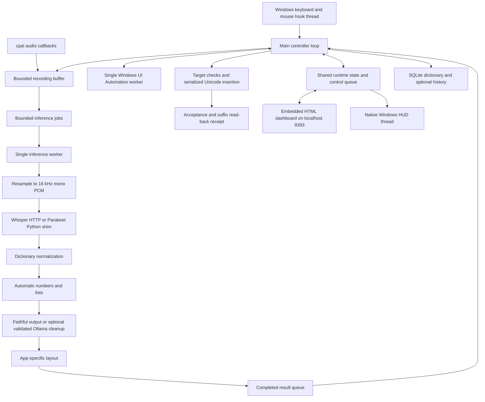

# Parla architecture comparison — 2026-09-16

The supplied review is substantially correct about the architecture and several remaining weaknesses. Its most consequential limitation is source selection: it reviewed the older `01-AI-Workflow/Projects/Parla/app` copy. The publication tree includes insertion safeguards and clipboard recovery missing from that copy. Several observations also describe deliberate product choices rather than demonstrated defects.

This review evaluates the original foundation and subsequent changes by the same standard. The original builders created the app; later revisions extended and changed its behavior. This is a code review, not a claim of comparative model superiority.

## Scope and evidence

- Reviewed the Rust entry point, controller, capture, hotkeys, targeting, insertion, recognition adapters and supervisor, formatter, dictionary, settings, history, dashboard, HUD, CLI evaluation paths, and relevant tests.
- Primary source: `publication/parla`, Git commit `15706f071bd88f3ae3606ef508540c2e41b17a15`. The working tree was clean at initial inspection.
- Compared source hashes with the older `01-AI-Workflow/Projects/Parla/app` copy. Runtime-critical differences include `context/target.rs`, `hotkey/windows.rs`, `inject/transaction.rs`, `pipeline.rs`, and `runtime.rs`.
- Inspected the running Parla process without restarting it. Its executable is `%LOCALAPPDATA%/Parla/releases/0.2.0-browser-prose-20260915/parla.exe`; SHA-256 is `D4FAF11A35C5759613B2C7211C55B999B3D2BDB9481B02E5A29FF6DF393E900E`, matching the recorded activation. This corroborates the release records; the binary does not embed a Git hash that independently proves its source revision.
- Fresh publication-tree test run: **116 passed, 0 failed, 3 ignored**. Fresh shim HTTP run: **5 passed**. Build output stayed outside Dropbox.
- Independently reran the older tree's Rust suite: **109 passed, 0 failed, 1 ignored**, exactly reproducing the supplied review's count. Its test report is credible; its scope differs from the release source.
- The ignored tests require live accessibility/HUD checks. They were not run. No production source, settings, dictionary, launchers, or running services were changed. No microphone capture, real-model inference, or application typing was performed.

Source paths below are relative to this repository root unless explicitly described as the older tree. The workspace comparison and test counts record the state before the September 16 documentation/mirror reconciliation.

## Architecture actually in use

The application is a native Rust Windows executable. `src-tauri` and the React scaffold are historical: Tauri is not an enabled dependency, `ipc.rs` is unimplemented, and the active UI is embedded HTML plus a native HUD. The live path uses OS threads and synchronous HTTP clients, not a running Tokio/Tauri application architecture.

The controller owns capture transitions and insertion. A single worker processes recognition and cleanup. Settings, dictionary entries, target observations, and app identity are captured for each utterance. Logical outstanding work is bounded to the configured pending count plus one, currently normalized to a total of two or three jobs. Completed jobs wait while another recording is active. Generation checks discard cancelled jobs' results; they do not interrupt an in-progress HTTP request.

Whisper runs behind localhost port 9292; optional Parakeet runs through a Python/sherpa-onnx shim on 9293. Ollama is optional for Polished mode and defaults to port 11434. Its streamed HTTP response is accumulated and validated before any text insertion. This release does **not** inject partial LLM tokens as they arrive, despite older status documents describing that behavior.

Dictionary replacements are deterministic, boundary-aware, longest-match, and non-cascading. Whisper receives canonical vocabulary as a prompt. The Parakeet adapter currently ignores its hotword argument; dictionary corrections still run after recognition for both backends. “Learn correction” updates spelling rules, not model weights.

Insertion uses Windows Unicode keyboard events. Multiline output uses Shift+Enter outside recognized browsers; browser output is flattened, including a second layout check at commit. A best-effort clipboard copy precedes insertion checks. The result distinguishes accepted-but-unverified insertion from suffix-confirmed insertion. Restore and spoken replacement commands require additional exact-range checks.

## Claim-by-claim assessment

### 1. Field-inspection failure weakens safety

**Verdict: correct for the inspected older copy; incomplete for the deployed release source. A residual risk remains.**

The older copy really returns a default context after failed inspection and lacks the input monitor. The current copy adds:

- `inspection_failed`, including explicit failure results and observation retry (`context/target.rs:38`, `:245`).
- An input-change counter maintained by keyboard/mouse hooks (`hotkey/windows.rs:31`).
- A native fallback requiring matching nonzero native handles, no known password flag, unchanged monitored input, and matching UIA runtime IDs when both are known (`context/target.rs:143`).
- Native focus, input-counter, and modifier checks for each output batch (`inject/transaction.rs:121`).
- Clamping accessibility text ranges to the editor's document (`context/target.rs:284`).

Therefore “only native handles” and “default context on every inspection failure” are stale descriptions of this release. However, native fallback is still weaker than positive UIA field identification. A programmatic field change with unchanged native handles and no monitored input could escape those guards when accessibility is unavailable. The fallback also permits insertion when password status could not be established. These are static risks, not reproduced wrong-field insertions.

The 120-character suffix criticism remains correct (`inject/transaction.rs:163`). For an insertion longer than that, a matching tail cannot establish that its prefix arrived. But the code already distinguishes `accepted_unverified` from `verified`, and replacement requires selecting and comparing the **entire original payload** before mutation (`context/target.rs:343`, `inject/transaction.rs:232`). A suffix false positive alone does not authorize deleting arbitrary text.

Improve the remaining distinction between native-only authorization, suffix confirmation, and full-range confirmation; preserve the existing protections.

### 2. The controller still blocks

**Verdict: correct.**

Capture draining, field observations, commit, read-back, and some persistence execute synchronously on the controller (`pipeline.rs:211`, `:350`, `:470`; `audio/capture.rs:260`). Capture draining defaults to 80 ms and is capped at 500 ms. A busy commit can delay processing the next start event. Timestamped stop events help trim the end of a clip; they cannot supply speech that occurred before recording started.

One qualification: after handling a start event, `mic.start()` runs **before** the initial UIA capture (`pipeline.rs:371`). Initial field inspection therefore does not itself delay starting audio capture once that part of the start handler is reached.

Both ASR clients allow a duration-scaled request timeout capped at 900 seconds. Generation cancellation suppresses stale results but leaves the single worker occupied until the request returns. `BackendManager::recover` is unused. The manager still has real startup and exited-process handling; an unused explicit recovery method does not mean all recovery is absent.

A commit worker is a plausible design, not a complete fix by itself. It needs controller authorization, cancellation checks, serialization, and defined behavior when a new recording overlaps an older insertion. Recording latency should be measured with injected slow dependencies before choosing the refactor.

### 3. Deterministic formatting bypasses the main validator

**Verdict: the execution-order facts are correct; treating that alone as a defect would be misleading.**

Numbers and lists run before cleanup-mode selection; numbers also run before the code-app exclusion (`pipeline.rs:108`, `formatter/layout.rs:5`). Browser layout is executable-wide. The LLM validator requires the substantive word sequence to remain unchanged, with limited filler removal, so Polished mode is conservative cleanup rather than general rewriting (`formatter/mod.rs:114`).

Automatic digits in both modes, lists in writing apps, and one-line browser insertion are documented features in the current README and release records. Removing them to enforce a literal interpretation of “Faithful” would change the product contract.

Numeric normalization intentionally changes words to digits; it would fail the LLM's word-sequence validator by design. Deterministic transformations need appropriate grammar, value-preservation, and item-preservation checks, not necessarily that same validator. Existing numeric/list modules already contain conservative guards and regression tests. An explicit transformation policy and clearer mode descriptions would help, but the review did not demonstrate a concrete bad transformation caused merely by this separation.

### 4. Replay does not reproduce production context

**Verdict: correct, and the gap also affects dashboard Retry.**

CLI replay sets `target: None` and `app: None` (`pipeline.rs:185`) and loads settings and dictionary from their normal installed locations (`main.rs:403`). This permits different behavior from browser or code-editor dictation. A polishing warning also returns CLI failure before printing the fallback, whereas live dictation can still insert normalized text.

The formatter golden suite contains four cases and is a smoke test, not an accuracy or end-to-end benchmark.

Additionally, `ReplayClip` retains audio, settings, and dictionary entries, but not app/context (`runtime.rs:30`). Dashboard Retry similarly constructs a context-free job (`pipeline.rs:287`). This can change list/layout/cleanup behavior for the same audio. Retry produces a preview rather than automatic insertion, so this is an output-consistency issue, not automatic typing into a newly selected field.

Preserve non-actionable formatting context in replay fixtures and retry records while keeping retry's no-insertion behavior explicit.

### 5. Configuration has multiple sources of truth

**Verdict: correct, with important qualifications.**

Saved settings, runtime display state, per-job snapshots, startup hooks, startup microphone allocation, and queue capacity have different application times. The general settings endpoint updates `runtime.settings`; the dedicated backend endpoint does not (`dashboard.rs:245`, `:405`).

However, immutable per-job snapshots are beneficial: an utterance should not change policy halfway through processing. The atomic backend selector is currently written but its getter is unused; live inference selects from the job's settings. It is obsolete plumbing, not a second active engine router racing the first one.

The dashboard already tells users to restart after changing shortcuts, microphone, or model paths (`src-tauri/assets/dashboard.html:143`). Thus it is not wholly silent about restart requirements. A remaining concrete inconsistency is raising `max_recording_seconds`: the next job can use the new setting while the existing microphone buffer retains its old cap (`audio/capture.rs:143`). The field called `effective_settings` is not an authoritative description of every running component.

One configuration owner with explicit application times would help; retain per-utterance snapshots.

### 6. Recovery and error visibility are weaker

**Verdict: mostly correct; dashboard-only recovery is outdated.**

There is one `LastResult`, one retained retry clip, and one command session. Later results replace earlier recovery state. HUD idle behavior hides the overlay even when an error exists (`runtime.rs:19`, `pipeline.rs:551`, `hud.rs:9`). The Error chime variant is also unused, so it does not currently supply missing failure feedback.

Current commits make a best-effort clipboard copy before target verification (`inject/transaction.rs:154`, `:204`). Failed insertion text therefore is not necessarily available only in the dashboard. Clipboard failure is deliberately nonfatal, and later clipboard writes can overwrite this backup.

SQLite history exists but is written on successful/accepted ordinary insertion, not on the failed-insertion branch (`pipeline.rs:514`). It is not a durable failure-recovery queue. A bounded recovery list and visible failure status remain worthwhile.

### 7. Source/release provenance needs consolidation

**Verdict: strongly correct; this review comparison demonstrates the cost.**

The older source, publication source, embedded guide snapshot, staged source, and status documents disagree. The reviewed running release has safeguards missing from the tree used by the other review. Select and document the authoritative source before planning changes.

Versioned releases, executable checksums, activation records, source-change manifests, and rollback tooling already exist. The missing improvement is a direct, automatic relationship from a binary to its source revision and dirty state. Do not describe provenance as entirely absent.

Parakeet already checks protocol version 2 and model directory in its health response (`asr/parakeet_local.rs:94`); content hashes for the actual model artifacts are still missing. The existing Whisper adapter explicitly reports external model identity as unverified.

Dead-code warnings are real, including recovery, old backend selection, VAD, duplicate WAV helpers, and IPC. They support a cleanup pass, but warning count alone is not evidence that a live path is defective. Tests also exercise helpers that production never calls, such as seam-casing and shortcircuit helpers; test count must not be equated with complete live-path coverage.

## Recommended sequence

1. Declare the release source and attach its revision to future reviews/builds. This is a small prerequisite, not a large refactor to defer until last.
2. Expand context-aware replay and the **existing** isolated field/multiline fixtures. Add slow-service/controller tests and missing-prefix receipt cases.
3. Make target trust and commit outcomes explicit; address unknown password status and weak receipt naming with application compatibility evidence.
4. Improve controller responsiveness and stalled-worker recovery while preserving ordering and stale-result rejection.
5. Retain bounded failed-result recovery and provide visible failure feedback.
6. Consolidate configuration and transformation policy while preserving the requested numeric/list/browser behavior. Remove unused scaffolding after tracing real call sites.

The foundation has useful boundaries, bounded work, deterministic corrections, and guarded insertion. Most of the other review's proposed direction is sound. Its corrections should be based on the current release source and should distinguish missing safeguards, partial safeguards, and intentional behavior.
